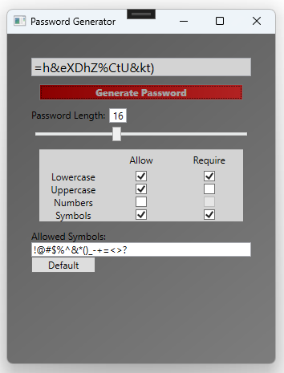

# Local Password Generator 🔑

A lightweight **password generator** built using **C# and WPF**. This tool generates secure passwords based on user-defined criteria.

## Features 🚀
- Generate **random and secure** passwords.
- Customize **password length**.
- Include/exclude **special characters**.
- Simple and user-friendly **WPF UI**.

## Installation 💻

### **Prerequisites**
- Windows OS
- [.NET 6.0 or later](https://dotnet.microsoft.com/en-us/download)
- [Visual Studio](https://visualstudio.microsoft.com/) (Recommended for modifying the source code)

### **Steps**
1. Clone the repository:
   ```sh
   git clone https://github.com/amcuddihy/LocalPasswordGenerator.git

2. Open the project in Visual Studio.
3. Build and run the application.

## Usage ⚡
1. Launch the application.
2. Click the **"Generate Password"** button.
3. Copy and use your newly generated password.
4. Adjust length and character options as needed.

## Screenshots 🖼️


## Contributing 🤝
Contributions are welcome! To contribute:
1. **Fork** this repository.
2. **Create a feature branch** (`git checkout -b feature-branch`).
3. **Commit your changes** (`git commit -m "Added a new feature"`).
4. **Push to your branch** (`git push origin feature-branch`).
5. **Open a pull request**.

## License 📜
This project is licensed under the **MIT License** – see the [LICENSE](LICENSE) file for details.

## Contact 📬
For questions or feedback, feel free to contact me through GitHub or submit an issue!

---

⭐ **If you like this project, consider giving it a star!** ⭐